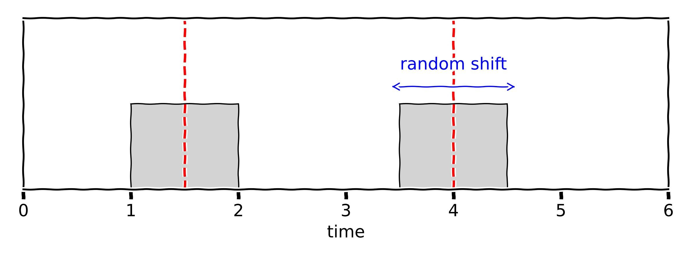
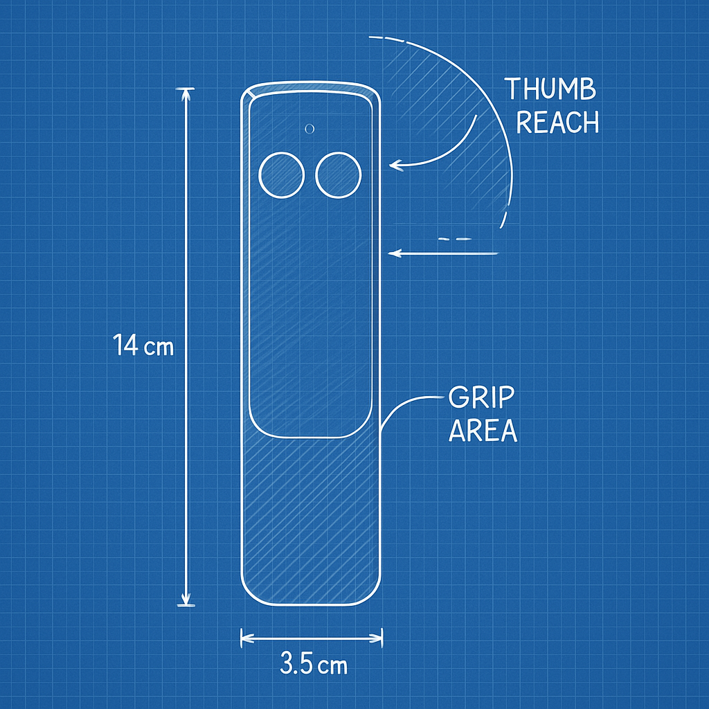

# skip-a-herz

|  | This is a submission for the [Hackaday 1Hz Challenge](https://hackaday.io/contest/203248ference) that explores the just noticeable difference (JND) in human perception of time gaps between tones. It plays tone pairs with varying delays and records user responses to estimate perceptual thresholds. |
|--|:--|

## 🧠 Concept

This project investigates how small a difference in timing between two tones must be for a person to just notice it. Participants listen to tone pairs with slightly varying intervals and respond when they perceive a change. The system estimates the perceptual threshold in real time.

### 🔧 Hardware

- Raspberry Pi Pico
- Active piezo buzzer
- 2 Buttons (for user input)
- 3D printed case
- Battery holder
- Batteries 2 x AA
- Optional: OLED display

### 🛠️ Software

### Firmware

The software creates several pulses with a variable spacing.

### Android app

To display the results.
Several choices:
- https://appinventor.mit.edu/
- BlueDash

### Design Decisions

I am using the pico because I'd like to have the option to use PIO if the normal GPIO intoduces to much jitter but it probably will work fine. The fear of jitter is also the reason for Rust as programming language. I think it produces conde whose timing is much more consitant (no garbage collector, ..)

### Case design

I want a simple, sleek handheld device with just two buttons like this:

## 📊 Future Features

- Data logging over USB serial
- Web-based interface for results

## 📄 License

MIT License

---

## 🤝 Contributing

Pull requests are welcome! For major changes, please open an issue first to discuss what you’d like to change.
